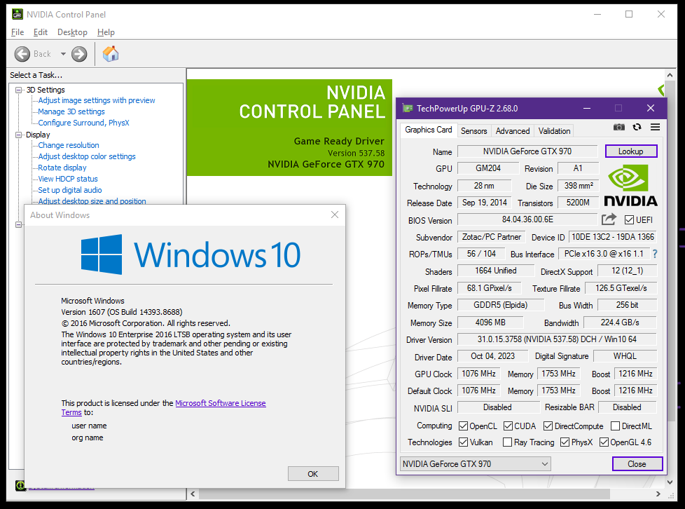

# Patched DCH NVIDIA Geforce driver for Windows 10 version 1607-1709

Since September 2021, NVIDIA has stopped releasing old WHQL releases that was used primarily on older versions of Windows prior to Windows 10, version 1803. It is possible to patch to force DCH drivers to install on older Windows 10 releases since early support was added sometime during the development of Windows 10 Anniversary Update. This was done by modifying the *.inf files to allow the installer to run on a unsupported build. The last known version that works with this workaround is 537.58, released on October 10th, 2023.

## Installation
1. Enable Test Mode through a elevated command prompt: `bcdedit /set {CURRENT} testsigning on`
2. [Download the official driver package](https://www.nvidia.com/download/driverResults.aspx/%20212701/en-us/)
3. Extract the installer with your desired file extractor (Ex. 7-Zip, WinRAR, etc.)
4. Replace original files with the patched ones
5. Run setup.exe
6. If the dialog says "Windows can't verify the publisher of this driver software", click "Install this driver software anyway"
7. Disable Test Mode: `bcdedit /set {CURRENT} testsigning off`

## Support
Tested on NVIDIA Geforce GTX 970 running on Windows 10 Enterprise LTSB 2016. I cannot guarantee that newer Geforce GPUs may work with this patch as I don't have the appropriate hardware to test it on.  

## Credit
* Jevil7452 for providing the guide on [how to patch a driver to run on older versions of Windows on WinClassic](https://winclassic.net/thread/1797/patch-driver-older-versions-windows)
